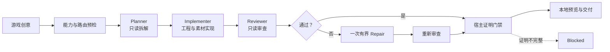
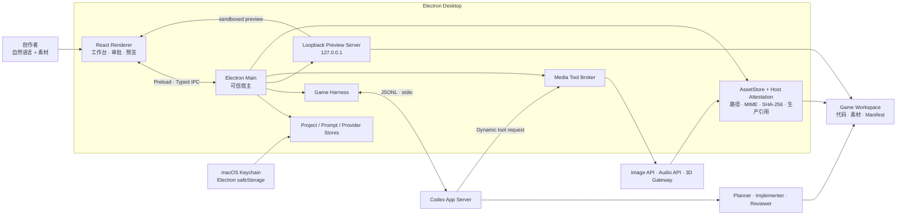

<p align="center">
  
</p>

<h1 align="center">Ludora</h1>

<p align="center">
  <strong>Turn ideas into playable worlds.</strong><br>
  基于 Codex App Server 的桌面游戏制作 Agent，把一句自然语言创意变成可玩的浏览器游戏工程。
</p>

<p align="center">
  <code>Electron</code> · <code>React</code> · <code>TypeScript</code> · <code>Codex App Server</code> · <code>macOS</code>
</p>


> **Ludora — Turn ideas into playable worlds.** Planner 先拆解创意，Implementer 在受控项目目录中实现，Reviewer 独立检查，宿主最后验证素材、代码引用与可运行结果。

## 先理解：这里有两个项目

| 对象 | 是什么 | 主要技术 |
| --- | --- | --- |
| Ludora 本体 | 运行在 macOS 上的 AI 游戏制作工作台，负责项目、Agent、素材、审批、预览与验证。 | Electron、React、TypeScript、Codex App Server |
| Ludora 生成的游戏 | 每个创意对应一个独立目录，里面是可以在浏览器运行和继续修改的普通游戏工程。 | HTML、CSS、JavaScript / TypeScript、Canvas，可按需要引入 Phaser 或 Three.js |

浏览器游戏并不是特殊的“AI 格式”：HTML 提供页面和 Canvas，CSS 控制外观，JavaScript/TypeScript 实现移动、碰撞、分数、敌人和胜负。AI 的工作是规划、编写和验证这些普通文件；即使不再使用 Ludora，生成的游戏目录仍可独立开发和构建。

新游戏默认从一个零运行时依赖的 Canvas vertical slice 起步：

```text
my-game/
├── index.html                         # 浏览器入口
├── src/main.js                        # 游戏循环、输入、碰撞与绘制
├── src/style.css                      # 页面与游戏样式
├── GAME_DESIGN.md                     # 玩法、控制和验收标准
├── AGENTS.md                          # 项目级 Agent 指令
├── .codex/skills/noobi-game-builder/  # 项目级游戏制作 Skill
├── .noobi/project.json                # Ludora 管理的项目元数据
└── public/assets/asset-pack.json       # 图片、音频和 GLB 素材清单
```

## 核心能力

| 能力 | 说明 |
| --- | --- |
| 一句话创建游戏 | 创建独立项目目录，生成浏览器游戏工程，并在应用内通过 loopback 服务器实时预览。 |
| Codex 原生运行时 | Electron Main 启动 `codex app-server --listen stdio://`，通过 JSONL/stdio 管理线程、工具调用、审批与流式事件。 |
| 受控 Agent 管线 | 顺序执行只读 Planner、可写 Implementer、只读 Reviewer；失败时最多执行一次有界 Repair 与复审。 |
| 多模态素材 | 图片优先走已配置 API，否则回退 Codex ImageGen；音频支持音乐、语音、人声音效及程序化声音；3D 支持同步 REST 网关、自包含 GLB 与程序化 Three.js。 |
| 动画与帧率契约 | 每轮判断动画应生成、复用或不需要；`30 / 60 / 120 FPS` 驱动时序、动画元数据、素材变体和审查策略。 |
| 制作工作台 | 展示 8 个制作阶段、实时事件、命令与文件审批、本地预览、文件树和统一素材库。 |
| 可扩展设置 | 管理媒体 Provider、Codex Skills、stdio/HTTP MCP Server，以及 Planner、Implementer、Reviewer、Repair 的私有补充提示词。 |
| 素材导入 | 选择器可导入图片、音频和自包含 GLB；素材页支持拖入 PNG、JPEG、WebP 图片。 |

## 从创意到可玩工程



UI 中的 `Brief → Scaffold → GDD → Assets → World → Code → Verify → Complete` 用于展示制作进度；真正的完成条件由 Reviewer 和宿主证明共同决定。

### 一次制作实际发生什么

1. **创建工作区**：Ludora 写入可运行的浏览器游戏起点、GDD、`AGENTS.md`、项目 Skill 和素材清单。
2. **能力预检**：检查 ChatGPT 登录、模型、图片路由、媒体配置和目标 FPS；图片 API 与 Codex ImageGen 都不可用时拒绝启动。
3. **Planner 规划**：使用临时只读线程检查现有文件，输出实现顺序、动画判断和验收方式。
4. **Implementer 实现**：使用每项目唯一的耐久可写线程修改工程、调用白名单媒体工具并运行验证；后续修改会恢复该线程。
5. **Reviewer 审查**：使用临时只读线程从实际文件验证玩法、素材、动画、FPS 和构建结果，而不是只相信实现摘要。
6. **一次 Repair**：审查不通过时，同一个 Implementer 最多修复一次，再由 Reviewer 复审；Repair 不是第四个独立 Agent。
7. **宿主证明门禁**：Main 最后校验生成素材的相对路径、MIME、SHA-256 和生产代码引用，通过后才标记完成。

## 系统架构



Renderer 不直接获得 shell、任意文件系统或 `child_process` 能力。Provider 密钥只在 Main 中解密和注入，不进入 Agent 参数、项目文件或 App Server JSON-RPC。

## 代码地图

| 目录 | 职责 | 初学建议 |
| --- | --- | --- |
| `src/renderer/` | React 工作台：项目、事件流、Composer、审批、预览、素材和设置。 | 想改界面时先看 |
| `src/main/` | Electron 可信宿主：项目、Codex Runtime、Harness、媒体、素材、预览和安全门禁。 | 理解完整流程后再看 |
| `src/shared/contracts.ts` | Renderer、Preload 与 Main 共用的类型化 IPC 契约。 | 查界面能调用什么 |
| `src/generated/codex/` | 从固定 Codex 二进制自动生成的 752 个 TypeScript 协议类型。 | 不手改，不必逐个阅读 |
| `schemas/codex/` | 同一 App Server 协议的 380 个 JSON Schema。 | 升级协议或排查字段时查 |
| `scripts/` | 协议生成、Codex/Harness/媒体/UI smoke。 | 验证集成时使用 |
| `docs/` | 产品功能、架构、Codex 源码基线和完整架构报告。 | 先读文档再跳代码 |
| `dist/` | 构建产物。 | 不作为源码编辑 |

`752` 个 TypeScript 文件和 `380` 个 JSON Schema 是 Codex App Server 的协议快照，不代表 1,132 个产品功能。它们由 `npm run protocol:generate` 从当前固定的 Codex `0.148.0` 二进制生成；升级运行时后应重新生成并审查差异。

可见品牌已经是 Ludora，但部分 IPC channel、Dynamic Tool、项目目录和 Skill 仍保留 `noobi_*` 兼容标识。它们属于当前协议的一部分，批量更名会影响旧线程与工具契约，不应只为外观进行替换。

## Prompt、Skill 与 Reasoning Effort

Agent 收到的指令按以下层次组合：

1. **宿主固定指令**：`src/main/gameHarness.ts` 中的 Planner、Implementer、Reviewer 角色权限，以及图片、动画、音频和 FPS 契约。需要改代码并重新验证，项目提示词不能覆盖。
2. **应用级补充提示词**：在“设置 → 提示词”中分别编辑 Planner、Implementer、Reviewer、Repair；保存到 app-private `prompt-templates.json`，适合约束技术栈、代码风格和验收偏好。
3. **项目级指令**：每个游戏的 `AGENTS.md`、`.codex/skills/noobi-game-builder/SKILL.md` 和 `GAME_DESIGN.md`，可随游戏一起审阅和版本管理；`.noobi/project.json` 由宿主管理，不应手改。
4. **当前请求与上下文**：用户本轮文字、Planner 计划、Implementer 摘要、Reviewer findings 和宿主证明状态，在每个 Turn 中动态拼装。

设置中的 Codex Skills 通过 App Server 原生接口启停；完成门禁所需的 ImageGen Skill 标记为 `LUDORA REQUIRED`，不可停用。MCP Server 可使用 stdio 或 HTTP 扩展工具，其中远端 HTTP 必须使用 HTTPS，认证只引用 Main 进程中的环境变量名。

`Reasoning Effort` 控制模型在当前 Turn 上投入的推理强度。可选值不是 Ludora 写死的，而是从当前模型的 `supportedReasoningEfforts` 动态读取，并传给 Planner、Implementer、Reviewer、Repair 和复审：

| 建议 | 适用场景 |
| --- | --- |
| `low` | 小范围文案、样式或明确的机械修改 |
| `medium` | 日常默认；小型玩法、一般功能和迭代 |
| `high` / `xhigh` | 复杂玩法、跨文件架构、疑难错误或严格审查；更慢，且只在模型支持时出现 |

更高 Effort 不等于必然更好的游戏，也不会增加工具权限；应先用 `medium`，只有任务确实复杂时再提高。

## 素材、动画与 FPS

| 类型 | 路由与验收 |
| --- | --- |
| 图片 | 启用的外部图片 API 优先；未配置或回退时使用 Codex ImageGen。项目完成前，宿主要求至少一张实际生成图片入库、SHA-256 匹配并被生产代码真实引用。 |
| 音乐 | 可路由 MiniMax Music 3.0；真实可用性由账户资格、区域、余额和首次生成共同决定。启用该路由时，完成门禁要求音乐文件落盘并由游戏代码播放。 |
| 语音 / 人声音效 | 可使用 MiniMax Speech、OpenAI Speech 或其他已配置 Provider；适合对白、喊声、喘息和生物人声。 |
| 通用音效 / 环境声 | 枪声、爆炸、脚步与环境底噪不会伪装成 MiniMax Speech 能力；使用已配置 Provider、导入素材、程序化 WAV 或 Web Audio。 |
| 3D | Meshy、Tripo、Rodin 目前按“同步 REST 网关”契约接入；也可导入自包含 GLB 2.0，或由 Agent 以 Three.js 程序化建模。 |

动画评估会选择 `generate`、`reuse` 或 `not-needed`：2D/2.5D 使用真实不同帧或 sprite sheet；rigged 3D 使用真实 GLB animation clip 与 mixer/action。单张图片整体平移或静态 mesh 位移不被当作角色关键帧动画。

目标 FPS 是制作与审查契约，不代表每秒生成 30、60 或 120 张图片，也不保证显示器实际输出 120 Hz。切换目标会让 Agent 审计 elapsed-time / fixed-step 时序、动画帧时长、source/target FPS 元数据和可用素材变体。

## 安全边界

- `BrowserWindow` 启用 `contextIsolation`、sandbox 与 `webSecurity`，关闭 `nodeIntegration`。
- API Key 经隔离 IPC 交给 Main，使用 Electron `safeStorage` 加密；macOS 上由 Keychain 支撑。
- 保存后 Renderer 只读取 `hasApiKey` 等状态，不回显密钥明文。
- 远端 Provider URL 要求 HTTPS；HTTP 只允许 localhost 开发网关。
- 素材 Manifest 被视为不可信输入；Main 会重新检查路径、symlink、MIME、大小、SHA-256、GLB 外部引用和生产代码引用。
- 每个项目在独立目录中运行；本地预览只绑定 `127.0.0.1`，不会自动发布到公网。

## 快速开始

需要 Node.js、npm，以及可用的 ChatGPT/Codex 账户。

在当前项目目录运行：

```bash
npm install
npm run dev
```

首次启动后，在“设置 → Codex 账户”中单独完成 ChatGPT 登录。Ludora 使用应用私有的 `userData/codex-home`，不会修改用户全局 `~/.codex`。

默认使用 `@openai/codex` 安装的当前平台二进制，并回退到 ChatGPT App 或 PATH 中的 Codex。也可显式覆盖：

```bash
LUDORA_CODEX_BIN=/absolute/path/to/codex npm run dev
```

## 从零学习 AI 游戏制作

建议先学习“生成的游戏”，再学习“生成游戏的 Ludora”：

1. 运行 Ludora，创建一个只有移动、收集、失败、获胜和重开的最小游戏。
2. 在生成目录中依次阅读 `index.html`、`src/style.css`、`src/main.js` 和 `GAME_DESIGN.md`。
3. 不依赖 AI，手动改一次移动速度、目标分数、颜色和敌人数量，再运行 `npm run build`。
4. 用 Composer 继续提出一个小修改，对照事件流观察 Planner、Implementer、Reviewer 分别做了什么。
5. 在设置中添加一条 Implementer 或 Reviewer 补充提示词，比较输出变化；不要先改宿主固定契约。
6. 熟悉普通浏览器游戏后，再按 `Renderer → Preload/IPC → Main → Codex App Server → GameHarness → Media/Gate` 的顺序阅读 Ludora 本体。

适合第一款练习游戏的描述：

> 制作一个俯视角收集游戏。方向键移动，收集 5 个星星获胜，碰到红色敌人失败，可以立即重新开始。保持规则简单，先完成一个可玩的循环再增加内容。

## 配置媒体服务

在“设置 → 媒体 API”中选择 Provider、模型与 Endpoint，并提交 API Key。外部 Provider 的设置检查只能确认当前探测能力；音乐资格、余额、区域限制和模型权限仍以第一次真实生成为准。

图片生成不是可选装饰：如果外部图片 API 与 Codex ImageGen 都不可用，Harness 会阻止启动，而不是用占位图伪装完成。3D 厂商预设当前要求同步返回媒体、base64 或同源 URL；厂商原生异步任务 API 需要先接入兼容网关。

## 验证

```bash
npm run verify          # typecheck + tests + production build
npm run smoke:codex     # Codex App Server
npm run smoke:harness   # 完整 Harness
npm run smoke:media     # 媒体路由
npm run smoke:image     # 图片生成契约
npm run smoke:ui        # 隔离数据的 Electron UI 截图
```

真实 Agent smoke 会使用已登录账户并消耗少量 Codex 或媒体 Provider 额度。

## macOS 打包

```bash
npm run package:mac
```

当前只定义 macOS DMG，并按执行构建的机器架构产出。公网分发前仍需配置 Developer ID Application、Apple notarization 与 staple；Intel Mac 需要在 x64 环境中单独构建。

## 当前边界

- 输出目标是独立浏览器游戏工程和本机 loopback 预览，不等于云部署、应用商店发布或原生 Unity / Unreal / Godot 导出。
- 生成质量、复杂度、可玩性与动画流畅度取决于模型、提示、依赖、素材/API 能力和审查结果；无法通过证明门禁的任务会标记为 `blocked`。
- 3D 厂商集成当前是同步 REST wrapper 契约，并非对每家厂商异步 API 的原生任务编排。
- 当前发行脚本以 macOS 为主，尚未提供 Windows / Linux release workflow。

## 文档

- [产品功能拆解](docs/PRODUCT_FUNCTIONS.md)
- [Codex App Server 架构](docs/ARCHITECTURE.md)
- [Codex 源码阅读基线](docs/CODEX_SOURCE_NOTES.md)
- [完整产品架构报告](docs/analysis/ludora-product-architecture.html)
