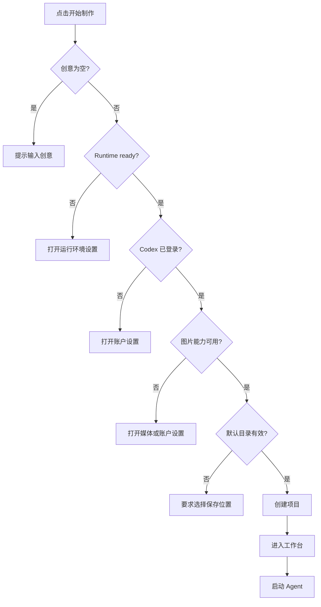

# Ludora UI 与首页简化技术开发手册

> 文档版本：V1.0
> 编写日期：2026-09-04
> 对应排期：[Ludora UI 与首页简化技术排期手册](./Ludora-UI与首页简化技术排期手册.md)
> 面向读者：Ludora 开发者、UI 实施人员、刚开始学习 React/Electron 的维护者

## 1. 手册用途

这份手册回答四个问题：

1. 当前界面代码是怎么组织的？
2. 新首页和新工作台应该怎么实现？
3. 哪些底层能力不能在本次改造中改变？
4. 开发完成后如何证明没有破坏原有功能？

本次目标：

> 把 Ludora 从“技术控制台式工作台”调整为“输入一句创意即可开始制作游戏”的创作工具。

## 2. 给初学者的快速说明

Ludora 可以简单理解成三层：

```text
用户看到的界面
└── src/renderer/        React 页面和组件

桌面应用的可信宿主
└── src/main/            Electron、项目文件、Codex、素材、预览

两层之间的通信约定
└── src/shared/          TypeScript 类型和 IPC 契约
```

这次只重点修改第一层 `src/renderer/`。

Renderer 不能直接操作任意文件、启动 Shell 或读取密钥。它只能通过 `window.noobi` 调用 Preload 暴露的安全接口。因此，简化 UI 不代表绕过原有安全逻辑。

## 3. 开发边界

### 3.1 允许修改

- `src/renderer/App.tsx`
- `src/renderer/ui.ts`
- `src/renderer/styles.css`
- `src/renderer/components/` 下与首页和工作台有关的组件
- 必要的 Renderer 纯函数测试
- UI 相关说明文档

### 3.2 默认禁止修改

- `src/main/` 中的 Codex、Harness、项目、素材和安全逻辑
- `src/shared/contracts.ts` 中的 IPC 契约
- `src/generated/codex/`
- `schemas/codex/`
- Prompt 模板
- 项目 Skill
- MCP 和媒体 Provider 协议

如果 Renderer 现有接口确实无法完成需求，应先记录原因，再单独评审是否扩大范围。本次不能为了界面方便，直接削弱登录检查、图片门禁或项目目录校验。

### 3.3 不引入的技术

- 不引入 Redux、MobX 等状态管理库。
- 不引入新的 UI 组件库。
- 不引入新的 CSS 框架。
- 不为了简单动画增加动画依赖。
- 不重新实现 React、Electron 或浏览器已经提供的能力。

## 4. 当前 Renderer 结构

### 4.1 应用入口

`src/renderer/main.tsx` 挂载 React 应用，`src/renderer/App.tsx` 是当前页面总控制器。

`App.tsx` 目前负责：

- 调用 `window.noobi.bootstrap()` 读取项目、设置、Runtime 和历史事件。
- 监听 Agent 事件、项目变化、Runtime 变化和审批事件。
- 保存当前项目、项目列表、事件、设置和弹窗状态。
- 创建项目、运行项目、停止项目。
- 拼装项目栏、顶栏、Pipeline、事件流、Composer 和 Inspector。

### 4.2 当前组件关系

```text
App
├── ProjectRail
├── Topbar（目前直接写在 App.tsx）
├── EmptyWorkspace
└── ProductionLayout
    ├── Pipeline
    ├── EventStream
    ├── Composer
    └── Inspector
        ├── Preview
        ├── Assets
        └── Files

全局弹窗
├── NewProjectModal
├── SettingsModal
└── ApprovalModal
```

### 4.3 当前必须注意的行为

Bootstrap 完成后，`App.tsx` 会把 `selectedId` 默认设置为第一个项目：

```ts
setSelectedId((current) =>
  current && state.projects.some((project) => project.id === current)
    ? current
    : state.projects[0]?.id,
);
```

这意味着：只要已经有项目，应用启动后会直接打开最近项目，而不是首页。

本次应改为：

- 冷启动默认进入首页。
- 用户主动选择项目后才进入工作台。
- Runtime 刷新或项目事件更新时，不应把用户强制送回首页。

## 5. 目标 Renderer 结构

建议结构：

```text
App
├── ProjectRail
├── WorkspaceHeader
├── HomeWorkspace
│   ├── IdeaComposer
│   ├── HomeStatusNotice
│   └── RecentProjects
└── ProductionLayout
    ├── ProductionCenter
    │   ├── CompactPipeline
    │   ├── EventStream
    │   └── Composer
    └── Inspector

全局弹窗
├── NewProjectModal（高级创建或信息补充）
├── SettingsModal
└── ApprovalModal
```

为了控制改动量，组件文件不必全部改名：

- `Pipeline.tsx` 可以继续使用原文件名，只改变展示方式。
- `Composer.tsx` 可以继续使用原接口，只增加高级设置折叠。
- `Inspector.tsx` 保留三个现有 Tab。
- 只建议新增一个核心组件：`HomeWorkspace.tsx`。

## 6. 数据与状态设计

### 6.1 App 继续持有的全局状态

| 状态 | 类型 | 用途 |
| --- | --- | --- |
| `projects` | `ProjectRecord[]` | 全部本地项目 |
| `settings` | `AppSettings` | 默认目录、模型、Effort、主题 |
| `runtime` | `RuntimeStatus` | Codex、登录、模型和能力状态 |
| `selectedId` | `string \| undefined` | 当前项目；为空时显示首页 |
| `events` | `Record<string, AgentEvent[]>` | 每个项目的制作事件 |
| `approvals` | `ApprovalRequest[]` | 待处理审批 |
| `error` | `string` | 全局错误提示 |
| `railOpen` | `boolean` | 小窗口项目抽屉 |
| `railCollapsed` | `boolean` | 桌面端项目栏收起状态 |

### 6.2 HomeWorkspace 自己持有的状态

建议把临时输入放在首页组件内：

```ts
interface QuickStartDraft {
  idea: string;
  name: string;
  parentDirectory: string;
  model: string | null;
  effort: string;
  targetFrameRate: TargetFrameRate;
}
```

说明：

- 这个类型只服务 Renderer，不放进 `src/shared/contracts.ts`。
- `CreateProjectInput` 不包含 `effort`；Effort 在后续 `runProject` 时传递。
- `name` 可以为空，提交前由 Renderer 生成默认名称。
- 用户修改高级设置后，折叠面板不应重置内容。

### 6.3 状态归属原则

- 跨页面、跨组件共享的状态放在 `App`。
- 仅首页表单使用的状态放在 `HomeWorkspace`。
- 仅 Composer 使用的高级参数继续放在 `Composer`。
- 仅 Inspector 使用的 Tab、文件选择和预览刷新继续放在 `Inspector`。
- 不把所有状态都提升到 `App`，避免 `App.tsx` 继续膨胀。

## 7. HomeWorkspace 开发说明

### 7.1 建议 Props

```ts
interface HomeWorkspaceProps {
  projects: readonly ProjectRecord[];
  settings: AppSettings;
  runtime: RuntimeStatus;
  imageGenerationAvailable: boolean;
  busy: boolean;
  onOpenProject: (project: ProjectRecord) => void;
  onOpenSettings: () => void;
  onStart: (draft: QuickStartDraft) => Promise<void>;
}
```

这是设计参考。实施时可以根据实际拆分调整，但首页不应直接知道 Electron Main 的内部实现。

### 7.2 页面组成

首页从上到下只包含：

1. Ludora 品牌名和一句说明。
2. 游戏创意输入框。
3. 三个可点击的示例创意。
4. “高级设置”折叠入口。
5. 唯一的主按钮“开始制作”。
6. 最多三个最近项目。

不再显示：

- 8 阶段 Pipeline。
- Runtime、Media、Projects 等统计卡。
- 大段技术说明。
- Thread、模型列表或工具能力详情。

### 7.3 示例创意

建议保留三个不同类型、但范围较小的例子：

- 制作一个俯视角收集游戏，收集 5 颗星星获胜。
- 制作一个横版跳跃游戏，躲避障碍并到达终点。
- 制作一个太空射击游戏，坚持 60 秒即可获胜。

点击示例只填充输入框，不立即创建项目，避免误触使用额度。

### 7.4 最近项目

- 使用 `projects.slice(0, 3)`，因为当前项目列表已经按 `updatedAt` 倒序维护。
- 卡片只显示名称、状态和最近更新时间。
- 点击后调用 `onOpenProject(project)`。
- 没有项目时，不渲染空卡片区，可显示一句“你的第一个游戏会出现在这里”。

## 8. 首页启动前检查

### 8.1 检查顺序

点击“开始制作”后按下面顺序检查：



### 8.2 为什么不能跳过图片能力检查

当前 Harness 要求最终项目包含可信生成并被生产代码引用的图片。如果外部图片 API 和 Codex ImageGen 都不可用，任务会被门禁阻止。

首页应该提前告诉用户怎么处理，而不是先创建和运行一个必然失败的任务。

### 8.3 主按钮状态

| 条件 | 文案 | 行为 |
| --- | --- | --- |
| 创意为空 | 开始制作 | 禁用 |
| 正在创建项目 | 正在创建… | 禁用 |
| 正在启动 Agent | 正在启动… | 禁用 |
| Runtime 未就绪 | 检查运行环境 | 打开设置 |
| 未登录 | 登录 Codex 后开始 | 打开账户设置 |
| 图片能力缺失 | 配置图片能力 | 打开设置 |
| 条件满足 | 开始制作 | 创建并启动 |

不要同时展示多个警告按钮。首页只提供当前最重要的下一步。

## 9. 一键创建并启动

### 9.1 关键原则

“一键开始”实际上是两个独立步骤：

1. 创建项目。
2. 启动 Agent。

这两个步骤不能当成一个不可分割操作，因为项目创建成功后，Agent 仍可能因登录变化、Runtime 错误或网络问题启动失败。

### 9.2 推荐调用流程

```ts
async function startFromHome(draft: QuickStartDraft) {
  const idea = draft.idea.trim();
  const name = draft.name.trim() || makeProjectName(idea);
  const model = draft.model || resolveDefaultModel(runtime, settings);

  const project = await window.noobi.createProject({
    name,
    idea,
    parentDirectory: draft.parentDirectory,
    model,
    targetFrameRate: draft.targetFrameRate,
  });

  setProjects((current) => upsertProject(current, project));
  setSelectedId(project.id);

  try {
    const runningProject = await window.noobi.runProject({
      projectId: project.id,
      prompt: idea,
      model,
      effort: draft.effort,
      targetFrameRate: draft.targetFrameRate,
    });
    setProjects((current) => upsertProject(current, runningProject));
  } catch (error) {
    setError(toMessage(error));
  }
}
```

上面是流程示意，不是要求逐字复制。

### 9.3 必须避免的状态问题

不要这样做：

1. 创建项目。
2. 调用 `setSelectedId(project.id)`。
3. 立刻调用现有依赖 `selected` 闭包的 `runProject()`。

React 状态更新不是立即同步完成，此时 `selected` 仍可能是旧项目或空值。

正确做法：

- 抽出接受明确 `projectId` 的启动函数；或者
- 创建后直接使用返回的 `project.id` 调用 `window.noobi.runProject()`。

### 9.4 创建成功、启动失败

启动失败时：

- 不删除刚创建的项目目录。
- 不清空用户创意。
- 项目保留为 `draft`、`failed` 或 Main 返回的真实状态。
- 工作台显示错误和“再次开始”按钮。
- 不自动重复调用，防止反复消耗额度。

### 9.5 默认项目名称

默认名称应在 Renderer 本地生成，不额外调用 AI：

1. 取创意第一行或第一个短句。
2. 去掉开头的“制作一个”“帮我做”等无意义词。
3. 合并多余空白。
4. 截取约 24 个 Unicode 字符。
5. 为空时使用“新游戏 + 日期时间”。

项目名称最长不能超过现有 `CreateProjectInput` 的校验范围。实现时应继续允许用户在高级设置中修改。

## 10. ProjectRail 开发说明

### 10.1 两种收起状态

当前 `railOpen` 主要服务小窗口抽屉。桌面端新增 `railCollapsed` 时不要混用：

- `railOpen`：小窗口项目栏是否覆盖打开。
- `railCollapsed`：桌面端项目栏是否缩成窄栏。

### 10.2 展开状态

显示：

- Ludora Logo 和名称。
- 新建游戏。
- 项目列表。
- 设置入口。

弱化或移除：

- 重复的完整 Runtime 说明。
- 项目数量的全大写技术标题。
- 与顶栏重复的状态信息。

### 10.3 收起状态

建议宽度约 60～68px，只显示：

- Logo / 首页入口。
- 新建按钮。
- 项目状态点或简单项目入口。
- 设置。
- 展开按钮。

所有纯图标按钮必须有 `aria-label` 和 `title`。

## 11. 顶栏开发说明

顶栏主信息：

- 首页：显示 Ludora。
- 项目页：显示项目名称和项目状态。

主要操作：

- 项目栏开关。
- 设置。

低频操作放入“更多”菜单：

- 在 Finder 中打开。
- 切换明暗主题。
- 查看运行环境。

可以优先使用原生 `<details>` + `<summary>` 实现简单菜单，避免增加复杂的菜单状态和外部依赖。需要保证 Electron 拖拽区域中的按钮继续设置 `-webkit-app-region: no-drag`。

## 12. Pipeline 开发说明

### 12.1 数据不变

继续使用：

- `PIPELINE_STAGES`
- `stageProgress(stage)`
- `ProjectRecord.stage`
- `ProjectRecord.status`

只改变视觉，不改变阶段含义和完成门禁。

### 12.2 紧凑展示

建议显示：

```text
正在实现游戏                         5 / 8
━━━━━━━━━━━━━━━━━━━━━━──────────────
```

可选的次级信息：

- 当前阶段中文名称。
- 运行中、等待、完成或失败。
- 点击“查看全部阶段”后才展示 8 个阶段。

### 12.3 无障碍要求

- 使用 `role="progressbar"`。
- 提供 `aria-valuemin="0"`、`aria-valuemax="8"` 和当前值。
- 不能只用颜色表达失败或完成，还要有文字。

## 13. EventStream 开发说明

### 13.1 信息分层

默认层显示：

- 用户提出的创意或修改要求。
- Planner 的计划摘要。
- Implementer 的主要执行进展。
- Reviewer 结论。
- 等待审批、失败和完成。

详细日志显示：

- `event.method`
- Thread ID
- 原始工具调用信息
- 很长的 thought、file 或 tool 输出
- 精确时间到秒等调试信息

### 13.2 不要丢弃事件

“默认隐藏”只是展示策略，不允许从 `events` 状态中删除事件。用户打开详细日志后，必须仍能看到完整事件内容。

### 13.3 建议实现

- 在 `EventStream` 内增加 `showTechnicalDetails`。
- 页面顶部或底部提供一个“详细日志”开关。
- 错误事件始终在普通层显示。
- 长内容继续沿用当前展开/收起逻辑。
- `aria-live="polite"` 保留，避免流式消息频繁打断辅助技术。

### 13.4 事件类型建议

| 类型 | 默认展示 | 备注 |
| --- | --- | --- |
| `user` | 是 | 用户创意和修改要求 |
| `plan` | 是 | 展示可读摘要 |
| `assistant` | 是 | 展示阶段结果 |
| `lifecycle` | 重要状态展示 | 重复心跳可进入详细日志 |
| `approval` | 是 | 用户需要处理 |
| `error` | 是 | 必须突出 |
| `file` | 摘要 | 文件明细放详细日志 |
| `tool` | 摘要或隐藏 | 原始输出放详细日志 |
| `thought` | 默认隐藏 | 仅详细日志展示可用内容 |

## 14. Composer 开发说明

### 14.1 默认视图

只显示：

- 输入框。
- “开始制作”或“继续制作”。
- Agent 运行时的“停止”。
- “高级设置”入口。

删除默认视图中的：

- Thread ID。
- `NEW CODEX THREAD`。
- 模型介绍长文。
- 始终展开的模型、Reasoning 和 FPS 控件。

### 14.2 高级设置

使用 `<details>` 或受控折叠区，包含：

- 模型。
- Reasoning Effort。
- 目标 FPS。
- 图片能力状态。

不要更改这些值向 `onRun()` 的传递方式。

### 14.3 提交行为

继续保留：

- `⌘ + Enter` 或 `Ctrl + Enter` 提交。
- 运行中禁用输入。
- 空输入时，草稿项目使用原始创意。
- 已有项目空输入时使用“继续完成并验证当前游戏”。
- 运行中显示停止按钮。

快捷键提示可以弱化显示，但功能不能删除。

## 15. Inspector 开发说明

Inspector 已经具备合理的三个 Tab：

- 预览。
- 素材。
- 文件。

本期不改变数据获取和素材安全逻辑，只调整视觉优先级。

### 15.1 预览优先

- 切换项目时继续默认回到预览。
- 宽屏下 Inspector 保持可见。
- 项目文件更新和终态变化时继续刷新预览。
- 保留刷新、外部打开等现有能力。

### 15.2 素材和文件

- 保留素材拖拽导入。
- 保留图片可信生成与引用状态。
- 保留文件树和文件读取。
- 减少 `LOCAL GAME PREVIEW` 等全大写技术文案，改成可读中文。
- 不根据 Renderer 中的公开 Manifest 自行判断素材可信状态。

## 16. 响应式布局

### 16.1 建议断点

| 宽度 | 布局 |
| --- | --- |
| `< 800px` | 项目栏为抽屉；制作区和预览使用单列或 Tab 切换 |
| `800px ～ 1199px` | 项目栏可收起；制作区在上、Inspector 在下 |
| `>= 1200px` | 项目栏 + 中间制作区 + 右侧 Inspector 三栏 |
| `>= 1500px` | 增加中间阅读留白和预览宽度，不增加更多信息 |

断点可沿用并调整当前 `800px`、`1200px`、`1500px` 结构，避免同时存在太多相近媒体查询。

### 16.2 布局优先级

空间不足时按以下顺序保留：

1. Composer 输入和执行按钮。
2. 当前制作状态和错误。
3. 游戏预览入口。
4. 项目切换入口。
5. 高级参数和详细日志。

## 17. CSS 开发规范

### 17.1 继续使用现有变量

继续使用 `styles.css` 已有的：

- `--bg`
- `--panel`
- `--panel-raised`
- `--text`
- `--muted`
- `--accent`
- `--green`
- `--red`
- `--line`

不在新组件中直接散落十六进制颜色。

### 17.2 新样式命名

建议使用清晰前缀：

```text
.home-workspace
.home-composer
.home-status-notice
.recent-projects
.compact-pipeline
.workspace-header
.composer-advanced
.technical-log-toggle
```

不要使用过于宽泛的 `.card`、`.content`、`.title`，以免影响设置页和弹窗。

### 17.3 视觉规则

- 主按钮只能有一个最强视觉层级。
- 普通区域尽量用留白分隔，减少层层边框。
- 正文优先使用 `--sans`；只有路径、代码和技术 ID 使用 `--mono`。
- 普通文字不使用全大写。
- 交互控件最小高度继续保持约 44px。
- 所有可点击元素保留清晰的 `:focus-visible`。

### 17.4 本期不全量拆 CSS

`styles.css` 当前约 3900 行，确实需要长期拆分，但本次不应把界面改造和全量样式架构迁移绑在一起。

实施方法：

1. 删除已经不再使用的首页旧样式。
2. 在对应模块附近添加新样式。
3. 每次修改后检查设置、审批和新建项目弹窗。
4. CSS 模块化作为后续独立任务处理。

## 18. 按文件实施说明

### 18.1 `src/renderer/App.tsx`

主要任务：

- 导入并渲染 `HomeWorkspace`。
- 冷启动保持 `selectedId` 为 `undefined`。
- 增加首页创建中的状态。
- 增加 `startFromHome()`。
- 抽出按明确项目 ID 启动 Agent 的函数。
- 增加桌面项目栏收起状态。
- 精简顶栏。
- 保留所有事件订阅和审批逻辑。

回归重点：

- 项目变化事件仍能更新当前项目。
- 当前项目删除或消失时能安全返回首页。
- 设置和审批弹窗仍显示在最上层。
- 错误 Toast 仍可关闭。

### 18.2 `src/renderer/components/HomeWorkspace.tsx`

主要任务：

- 管理首页草稿。
- 展示创意输入、示例、高级设置和最近项目。
- 根据 Runtime 状态给出唯一主操作。
- 提交时把完整草稿交给 `App`。

组件不负责：

- 直接维护项目列表。
- 监听 Agent 事件。
- 调用 Main 内部服务。
- 修改 Prompt 或 Skill。

### 18.3 `ProjectRail.tsx`

- 新增 `collapsed`、`onToggleCollapsed` 等必要 Props。
- 区分桌面收起和移动抽屉。
- 保留 Home、新建、选择项目和设置回调。

### 18.4 `Pipeline.tsx`

- 保留现有 Props。
- 删除横向 8 卡片的默认展开形式。
- 由 `stageProgress` 计算进度条值。
- 为状态提供可读中文。

### 18.5 `EventStream.tsx`

- 增加普通视图和详细日志视图。
- 隐藏不等于删除。
- 错误、审批、完成始终可见。

### 18.6 `Composer.tsx`

- 保留现有 `onRun` 和 `onStop` 契约。
- 增加高级设置折叠。
- 将 Thread ID 移入详细区域或移除视觉显示。
- 保留模型与 Effort 的兼容校正逻辑。

### 18.7 `Inspector.tsx`

- 保留数据加载、拖拽导入和安全状态。
- 默认 Tab 仍为 `preview`。
- 只调整标签、工具栏和布局视觉。

### 18.8 `NewProjectModal.tsx`

有两种用途，实施时选择其中一种：

1. 作为“高级创建”完整表单保留。
2. 只在默认目录等必要信息缺失时作为补充表单。

推荐第一种，更容易回退，也为高级用户保留完整入口。首页主流程不再强制打开它。

### 18.9 `src/renderer/ui.ts`

适合放置：

- 默认项目名生成纯函数。
- Runtime 主操作判断纯函数。
- 新的中文展示标签。

不适合放置：

- React 状态。
- Electron API 调用。
- 项目创建副作用。

## 19. 错误处理规则

### 19.1 错误分级

| 级别 | 示例 | 展示方式 |
| --- | --- | --- |
| 表单错误 | 创意为空 | 输入框附近提示 |
| 可配置错误 | 未登录、图片能力缺失 | 首页状态条 + 设置入口 |
| 操作错误 | 创建失败、启动失败 | 保留输入或项目 + Toast/内联错误 |
| 项目错误 | Agent、构建或审查失败 | 工作台事件流突出显示 |
| 系统错误 | Bootstrap 无法连接 | 保留当前全屏重试状态 |

### 19.2 文案规则

错误文案应包含：

1. 发生了什么。
2. 用户下一步能做什么。

示例：

- 不推荐：“Runtime error”。
- 推荐：“Codex 运行环境尚未就绪，请打开设置检查。”

不得向普通首页直接显示长堆栈、RPC 方法或原始 JSON。

## 20. 无障碍与键盘操作

- 首页输入框必须有真实 `label` 或 `aria-label`。
- 主按钮的禁用原因必须有可读提示。
- 项目状态不能只用颜色表达。
- Icon-only 按钮必须包含 `aria-label`。
- Tab 继续使用 `role="tablist"`、`role="tab"` 和 `aria-selected`。
- 进度条使用 `role="progressbar"`。
- 错误使用 `role="alert"`，普通状态使用 `role="status"`。
- 不移除全局 `:focus-visible`。
- `⌘/Ctrl + Enter` 提交继续生效。
- 尊重 `prefers-reduced-motion`。

## 21. 开发步骤

每个阶段遵循下面的循环：

1. 先保存当前界面截图。
2. 只改一个组件或一个清晰行为。
3. 运行 TypeScript 检查。
4. 在 Electron 中手动操作。
5. 检查明暗主题和小窗口。
6. 确认后提交，再进入下一阶段。

推荐实施顺序：

```text
HomeWorkspace 骨架
→ 首页状态与最近项目
→ 一键创建/启动
→ ProjectRail 与顶栏
→ Pipeline
→ Composer
→ EventStream
→ Inspector 视觉整理
→ 响应式与完整回归
```

## 22. 测试策略

### 22.1 自动验证

每次核心修改后：

```bash
npm run typecheck
```

每天结束时：

```bash
npm run test
npm run build
```

阶段完成时：

```bash
npm run smoke:ui
npm run verify
```

### 22.2 纯函数测试

如果在 `ui.ts` 新增以下纯函数，建议增加对应 Vitest 测试：

- 从创意生成默认项目名。
- 根据 Runtime 状态决定首页主操作。
- Pipeline 当前进度和中文状态映射。

测试至少覆盖：

- 中文创意。
- 英文创意。
- Emoji 和超长创意。
- 空白输入。
- Runtime starting、ready、error。
- 已登录和未登录。
- 图片能力可用和不可用。

当前项目没有 Renderer DOM 测试依赖。本期不要为了一个简单页面引入大套测试框架；复杂交互使用 Electron UI smoke 和人工验收。

### 22.3 不默认运行的测试

以下命令可能连接真实 Codex 或媒体服务并消耗额度，不作为纯 UI 改造的每次提交检查：

```bash
npm run smoke:codex
npm run smoke:harness
npm run smoke:media
npm run smoke:image
```

只有需要验证真实集成且账户条件允许时再执行。

## 23. 手工验收用例

### 23.1 首页

- [ ] 没有项目时能看到输入框和开始按钮。
- [ ] 已有项目时冷启动仍进入首页。
- [ ] 最近项目最多显示三个。
- [ ] 点击最近项目能进入正确工作台。
- [ ] 点击示例只填入内容，不自动提交。
- [ ] 空创意不能提交。
- [ ] 创建失败后创意仍在。

### 23.2 账户与能力

- [ ] Runtime starting 时提示等待或检查。
- [ ] Runtime error 时显示可读错误和设置入口。
- [ ] 未登录时主操作进入账户设置。
- [ ] 没有图片能力时进入正确配置页面。
- [ ] 模型列表为空时不会提交无效选择。

### 23.3 创建与运行

- [ ] 默认目录、模型、Effort 和 FPS 正确使用。
- [ ] 点击开始后只创建一个项目。
- [ ] 创建成功后打开正确项目。
- [ ] Agent 只启动一次。
- [ ] 启动失败后项目仍存在。
- [ ] 失败后可以手动再次开始。
- [ ] 运行中可以停止。

### 23.4 工作台

- [ ] 项目栏可展开和收起。
- [ ] 当前项目名和状态正确。
- [ ] 进度条随项目 stage 更新。
- [ ] 普通视图不显示 Thread ID 和方法名。
- [ ] 详细日志仍能查看技术内容。
- [ ] 预览、素材、文件三个 Tab 正常。
- [ ] 素材拖拽导入没有被破坏。
- [ ] 审批弹窗仍可正常处理。

### 23.5 界面适配

- [ ] 深色主题可读。
- [ ] 浅色主题可读。
- [ ] 800px 以下没有横向溢出。
- [ ] 800～1199px 输入区和预览可操作。
- [ ] 1200px 以上显示完整三栏。
- [ ] 键盘焦点清楚。
- [ ] 减少动态效果设置生效。

## 24. 代码审查清单

提交前逐项确认：

- [ ] 改动只发生在本期范围内。
- [ ] 没有修改或重新生成 Codex 协议文件。
- [ ] 没有绕过 Runtime、登录和图片能力检查。
- [ ] 没有把 API Key 或敏感信息送入 Renderer 日志。
- [ ] 没有依赖 React 状态立即更新。
- [ ] 没有在错误后自动无限重试。
- [ ] 没有删除现有项目、素材或文件。
- [ ] 没有因“隐藏技术信息”而丢弃事件数据。
- [ ] 所有图标按钮都有无障碍名称。
- [ ] 新样式同时支持明暗主题。
- [ ] `npm run verify` 通过。

## 25. Git 提交建议

建议按可回退的小阶段提交：

```text
refactor(ui): add simplified home workspace
feat(ui): start projects from a game idea
refactor(ui): simplify production workspace
refactor(ui): move advanced controls and logs
fix(ui): polish responsive states and accessibility
```

不要把生成文件、旧品牌图片或与本次无关的本地文件混入提交。

每次提交前使用：

```bash
git status --short
git diff --check
npm run typecheck
```

## 26. 初学者推荐阅读顺序

如果要一边开发一边学习，按下面顺序阅读：

1. `src/renderer/App.tsx`：先看页面数据从哪里来。
2. `src/shared/contracts.ts`：看项目、Runtime 和事件分别包含什么字段。
3. `src/renderer/components/ProjectRail.tsx`：看父组件如何把数据和回调传给子组件。
4. `src/renderer/components/Composer.tsx`：看表单状态和执行回调。
5. `src/renderer/components/EventStream.tsx`：看数组如何渲染成事件列表。
6. `src/renderer/components/Inspector.tsx`：看组件如何异步读取预览、素材和文件。
7. `src/renderer/styles.css`：最后理解布局和响应式规则。

不要先进入 `src/generated/codex/` 阅读几百个协议类型。它们不是本次 UI 开发的入口。

## 27. 常用名词

| 名词 | 简单解释 |
| --- | --- |
| Renderer | 用户看到和操作的 React 界面 |
| Electron Main | 管理窗口、文件、Codex 和安全能力的桌面主进程 |
| Preload | Renderer 和 Main 之间的安全桥梁 |
| IPC | Renderer 与 Main 之间发送请求和结果的通信方式 |
| Runtime | 当前 Codex 运行环境和账户状态 |
| Pipeline | 游戏制作阶段的展示进度，不是最终安全门禁 |
| Composer | 用户给 Agent 输入制作要求的区域 |
| EventStream | 展示 Agent 计划、操作和结果的事件列表 |
| Inspector | 预览、素材和文件查看区域 |
| Reasoning Effort | 模型本轮投入的推理强度 |
| Smoke Test | 快速验证关键链路是否能跑通的测试 |

## 28. 完成定义

同时满足以下条件，才算本次开发完成：

1. 冷启动默认显示简化首页。
2. 用户可以输入一句创意并开始制作。
3. 创建和启动分步处理，失败可以恢复。
4. 项目页形成左项目、中制作、右预览的清晰结构。
5. Pipeline、模型、Reasoning、FPS 和技术日志默认不抢占注意力。
6. 高级用户仍能使用全部现有能力。
7. 登录、图片、审批、素材安全和 Agent 流程没有被削弱。
8. 明暗主题和主要窗口宽度可正常使用。
9. `npm run verify` 和 `npm run smoke:ui` 通过。
10. 本手册的手工验收清单全部完成并记录结果。

完成后，用户首次打开 Ludora 时应该只需要理解一件事：

> 在输入框里描述想做的游戏，然后点击“开始制作”。

## 29. 实际开发记录

本手册描述“应该怎样开发”。已经完成的修改、验证结果、待人工确认项和 Git 状态统一记录在：

- [Ludora-UI与首页简化开发记录.md](./Ludora-UI与首页简化开发记录.md)
